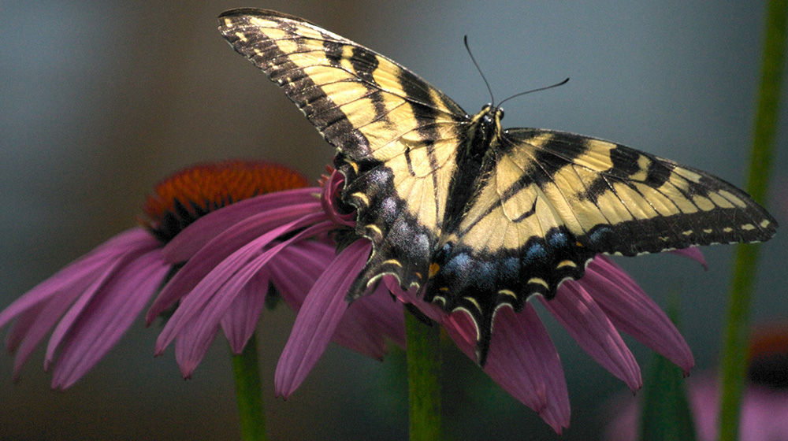

# Usage:
### save.py
1. Enter string that you want to hide in the image
2. Input location of the image in which you want to hide the text
3. Enter the location of the one time pad you want to use to encrypt the text
4. Input the pixel at which you want the bit encoding to start
5. The program will save a file with the hidden text

### extract.py
1. Enter location of the image with hidden text
2. Input length of the hidden text that was entered into the image
3. Enter the location of the one time image that is used to decrypt the text
4. Input the number of the pixel at which the encoding starts
5. The program will output the text

# How it works
To hide the text, the program first converts the text entered into ASCII codes and converts them into binary. However, not all ASCII codes are the same length so to prevent complications when reading back the bits, the program standardises their lengths to 8 and stores them in an array. The program then combines the array into one long bit stream. After that, the program goes to the starting pixel and converts the brightness red channel into binary and changes the last bit to match the first bit in the array of bits and saves it to an array of the same dimensions as the image at the location in the original image. This array is the output array. It then goes to the next pixel and matches the last bit of the value of the red channel to match the next bit in the bit array and adds it to the output array at the same image. This repeats for every other pixel.

The program then saves the output array as another image which looks almost the same as the original to the human eye, only with microscopic differences (maximum absolute difference of 1) in the red channel. Unfortunately due to compression, JPGs cannot be used since the last bit is changed so it can't be read back, which is not ideal.

In the end, you are left with an image which can have the last bits extracted after a following starting point and every 8 bits would form an ASCII code that can be converted back into the original characters. To make the data harder to read back, the length the ASCII codes are standardised too can be varied to random amounts, though this would mean the maximum amount of text storable is decreased if you increase the standardised length.

However if you used a one-time pad image, you can encrypt the series of bits with the corresponding end bits from another image. In this program, I encrypt the bits of the text you want to save by using an XOR operator with the end bits of the binary blue channel brightness of the same pixel coordinates in the image as the original bits are being saved in. This means that the one time pad image has to be greater or same in all dimensions being used.

When decrypting, the program gets the blue channel brightness of the one time pad and XORs it with the extracted bits from the image that's being decrypted to get the original ASCII values back.

Original image:

Image with hidden text:

# Accessing Hidden Example PNG
Enter File Location: output.png

Enter number of characters of hidden text: 21

Enter file location of one-time pad image: vernam.jpg

Enter Starting Point of Pixels: 348

Steganography is cool
